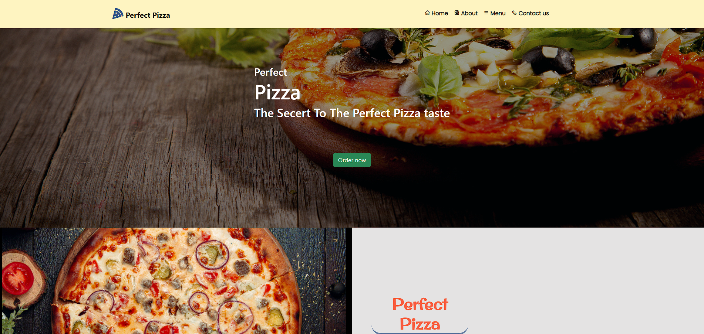

# PerfectPizza 🍕

**PerfectPizza** is a web application designed to showcase delicious pizza options with an intuitive and interactive interface.



## Features

- Browse a variety of pizza options with visuals and descriptions.
- User-friendly navigation for a seamless browsing experience.
- Responsive design for both desktop and mobile users.

## Getting Started

To view the project, you can visit the live site at [PerfectPizza](https://fighteros.github.io/PerfectPizza/#header).

Or, to run it locally:
1. Clone the repository:
   ```bash
   git clone https://github.com/Fighteros/PerfectPizza.git
### Technologies Used 
----------------- 
* HTML, CSS, JavaScript
* GitHub Pages for hosting

### Contributing

Feel free to fork this project, make your own changes, and submit a pull request!

### License

This project is licensed under the MIT License.

